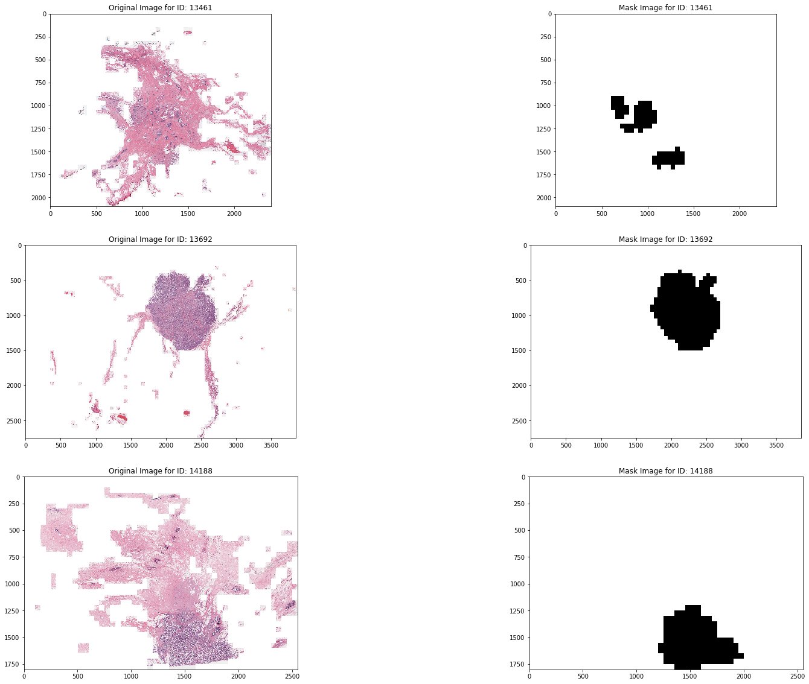
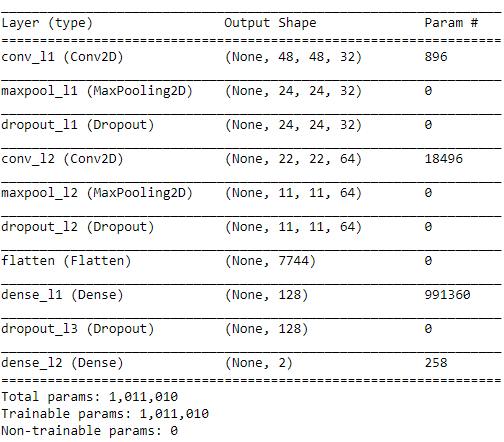
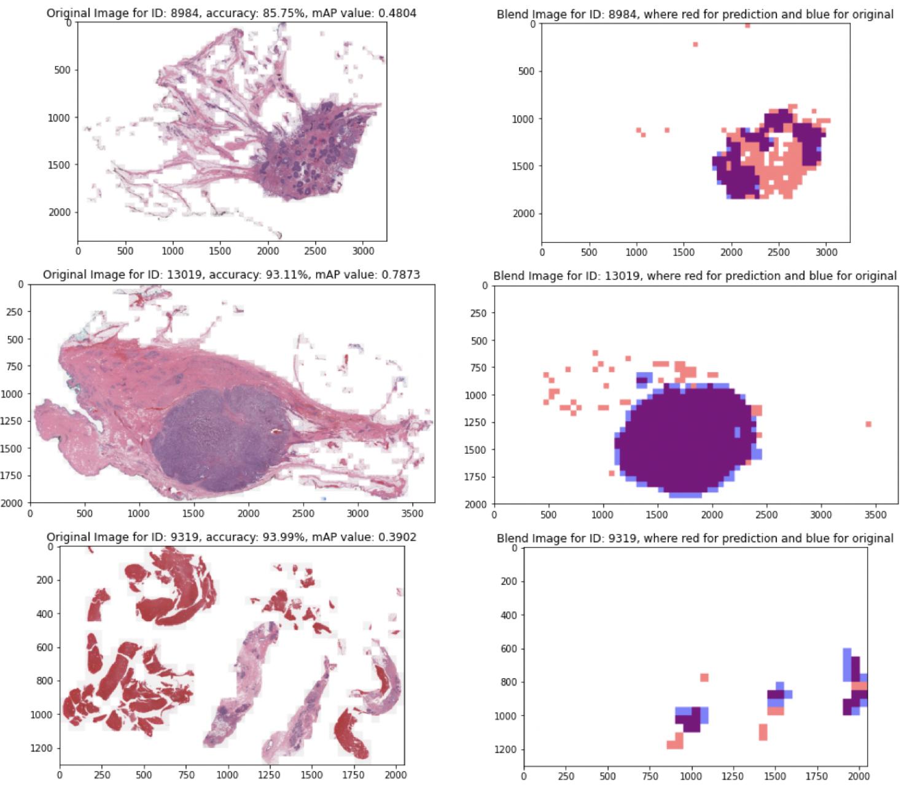

# Breast Tumor Segmentation by CNN Classifier

This is a co-op project about applying Convolutional Neural Networks(CNN) in Keras for segmenting tumor in breast slide images.

## Dataset

The original dataset applied for training CNN classifier is from source: https://www.kaggle.com/paultimothymooney/breast-histopathology-images. In detail, raw data contains several sub files where each files contains images for a certain patient ID. 

In each sub files, two files labeled as 0, and 1 are included in where 0 indicates images inside represents normal tissue and 1 means images insides indicates tumor region. For each image inside with similar shape as 50 * 50* 3, the original coodidate of it and correspond label are attached in the image's name. Based on these inofrmation, the original slide image and correspond mask could be built from the labels of its each portion.

For the masks for different ID on the right of the subplot, the black region indicates the tumor region in original slide image.

In this project, 28 cases were chosen apart randomly from whole dataset for testing/validating purposes and remains were used as training.

## Data Processing:

After train/test split, since the knowing of the biased distribution of labels in training dataset where labeled 0 images are too much, extra sampling mechanisms was applie as increasing # of label 1 images(over-sampling) or decreasing label 0 images(down-sampling).

Three data processing cases were arised:

1. original biased: After train/test split, the training dataset was directly concatenated into arrays.

2. ori-sampling: After train/test split, specificaly cropping the tumor regions from original slide image of each patient ID(training cases only) for realizing uniform label distribution of training data.

3. down-sampling: After train/test split, specificaly decreasing the label 0 imaged of each patient ID(training cases only) for realizing uniform label distribution of training data.

In the end, training/testing dataset were stored in .h5 files for further access.

## Models:

The CNN was built in Keras and structure could be shown as:

The classifier model was structured by two convolutional stacks(Convolutional layer, Maxpooling layer, Dropout layer) and one fully connected stack(Dense layer, Maxpooling layer, Dropout layer).

## Performance:

In testing phase, the performance of models was measured by accuracy and mAP for a patient ID:

1. accuracy was defined for measuing the classifying performance for inputting images: For a specific patient ID, 

accuracy = # of correct predcited images/# of total images

2. mAP was defined for measuring the segmentation performance of classifier:

mAP = intersect(mask_predicted, mask_original)/union(mask_predicted, mask_original)

For both values with similar range [0, 1], if value is close to 1, model's classifying/segmentation performance would be good and bad for else. Comparing the performances of segmentation ofr three processing mechanisms, over-sampling works best with average accuracy and mAP as 
87.25% and 0.62.

The randomly picked testing cases with slide images on left side and blended mask image(red for predicted, blue for original, purple for overlaid) on right side is shown below:

## Resource
https://www.kaggle.com/paultimothymooney/breast-histopathology-images

